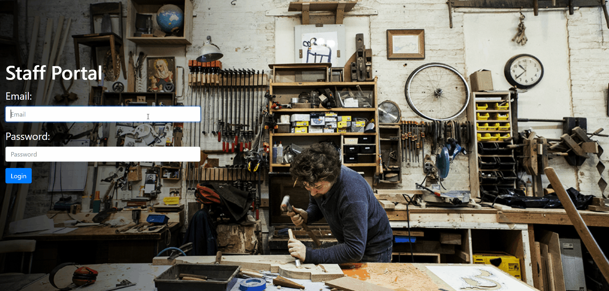
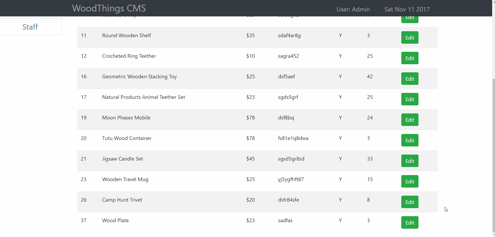
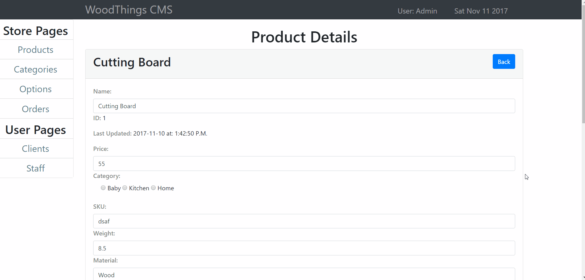
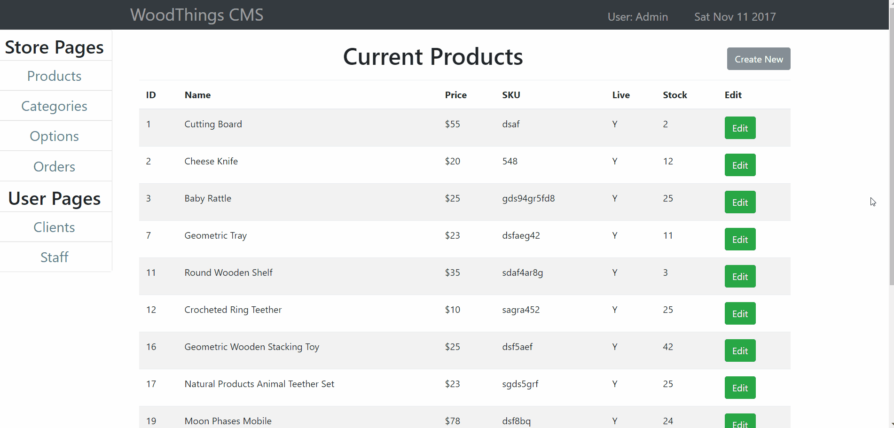

# sales-CMS
(In Development) CMS application for a sales site

###### This website runs custom built api requests to interact with the SQL databse, and dynamically creates components based on these queries. It uses:
- Angular (2)
- TypeScript
- Node
- Express
- Bootstrap
- CSS3 & html5

## Demo:
#### Clients can browser through the sales site, which is the primary landing page. Routes are connected to category id's and passed to the database to dynamically generate item components.

Note: This is simply a mock-up client UI to demonstrate the dynamic content being managed by the CMS.

#### Staff can navigate to the staff portal to login to the CMS.

## Staff Portal Overview:
- The staff Portal displays the Current User and date in the nav-bar.
- The admin-sidebar component contains links to various components which allow staff to CRUD, or otherwise visualize data from the give portions of the SQL database. 
Note: For the current version, only the products component is fully functional.
- The products component displays all current products with relevant overview information pertaining to each product, as well as the database ID in the event IT is contacted to run item-specific updates beyond the scope of staff and the CMS.

## Staff can:

- Create new products.

- Update existing products.

    - Products also display "Last Updated" fields for reference, future development will display the staff user who made the last update.
    

- Delete existing products.

